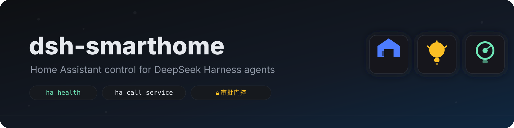
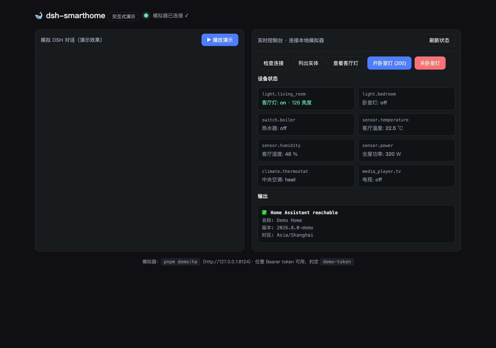
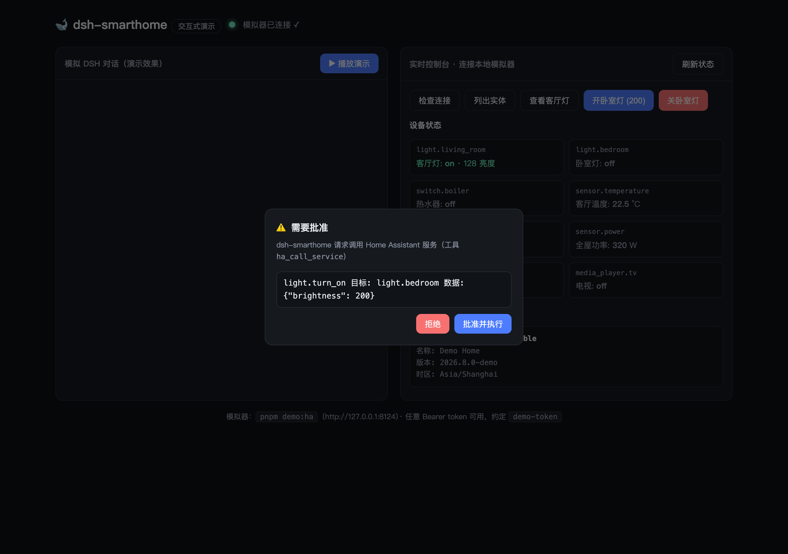
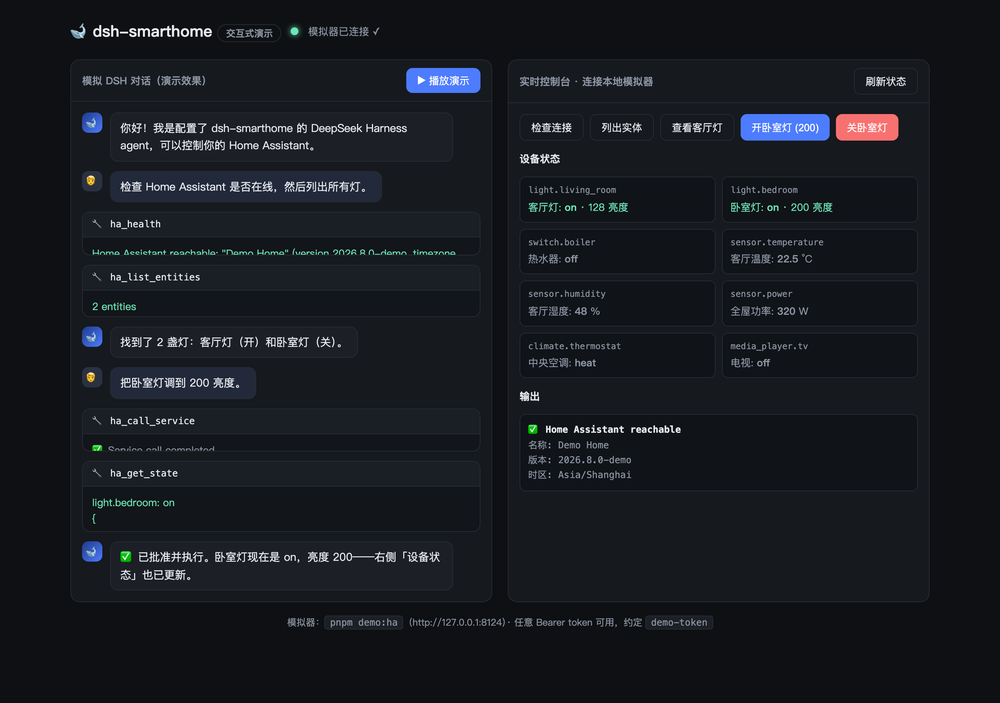
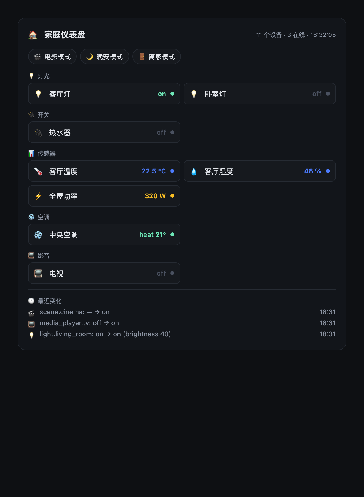

<p align="center">
  
</p>

<p align="center">
  <b>Home Assistant control for <a href="https://github.com/deepseek-ai/deepseek-harness">DeepSeek Harness</a> agents.</b><br>
  Read entity states · query history · call services — every state-changing call sits behind a human approval gate.
</p>

<p align="center">
  <a href="README.zh.md">中文</a> ·
  <a href="https://github.com/topics/dsh-plugin"></a> ·
  <a href="LICENSE"></a> ·
  <a href="https://github.com/YLifeOnlyOnce/dsh-smarthome/actions/workflows/ci.yml"></a>
</p>

<p align="center">Zero runtime dependencies beyond the harness itself. Uses Home Assistant's built-in REST API — no MQTT, no WebSocket, no extra daemon.</p>

---

## ✨ What it looks like

Click any image to open the live demo — [`docs/demo.html`](docs/demo.html) simulates the full DSH conversation, and its live console talks to the bundled HA emulator (no real Home Assistant needed).

| ① Ask | ② Approval gate | ③ Done — state changed |
|---|---|---|
|  |  |  |
| The agent lists your lights with `ha_list_entities`. | `ha_call_service` pauses for a human approval dialog. | Approved — `ha_get_state` confirms the light turned on. |

**And the Web UI dashboard card** — call `ha_dashboard` and get a live snapshot of the whole home rendered right in the conversation:

<p align="center"></p>

## 🎯 What can it do?

Talk to your home the way you talk to an assistant — every write goes through a human approval gate first.

| You say | What happens |
|---|---|
| "Check the whole house — which devices are still on?" | Agent scans with `ha_list_entities` / `ha_get_state` and summarizes |
| "Show me the home dashboard." | `ha_dashboard` renders a **live dashboard card** in the conversation — devices, scenes and recent changes at a glance |
| "Set the bedroom light to 200 brightness." | `ha_call_service` → **approval dialog** → executes → state updates instantly |
| "Turn off every light in the living room." | **Area targeting** — one call controls the whole room |
| "Start cinema mode." | Scene activation: dimmed lights + TV on — a whole cascade of devices in one shot (`ha_events` shows each change live) |
| "What changed in the house in the last hour?" | Real-time `state_changed` events from the **WebSocket** feed |
| "Is the living room warm enough? Compare with the bedroom." | `ha_get_state` / `ha_render_template` over sensors |
| "Turn everything off, I'm leaving." | One scene (`scene.away`) or a multi-entity service call |

## 💡 Why it's good — how useful is it?

- **One-line install**: `dsh plugin --profile web add dsh-smarthome`, then just talk to the agent.
- **Safe by default**: every state-changing call stops for human approval; `allowedDomains` is a second deny-list belt. The agent can never touch your home without you saying yes.
- **Natural language control**: no apps to fiddle with, no API docs to memorize — "dim the lights" just works.
- **Always current**: state changes reach the agent in real time over WebSocket, so it never "thinks" the light is still on when you switched it off.
- **Lightweight**: zero runtime dependencies — plain REST + Node's built-in WebSocket. No MQTT broker, no extra daemon.
- **Try it without Home Assistant**: the repo ships a demo emulator + interactive demo page — 5 minutes to a full feel of the plugin.
- **Engineered, not hacked together**: 24 tests including a full **real agent-loop end-to-end** suite, strict TypeScript, CI.

## 🛠 Features

| Tool | Description | Approval |
|---|---|---|
| `ha_health` | Verify the connection; return instance name, version, timezone, WebSocket status | read |
| `ha_list_entities` | List entities, filter by domain (`light`, `switch`, `sensor`…) and text | read |
| `ha_list_areas` | List rooms (areas) via the WebSocket API, e.g. `living_room` | read |
| `ha_get_state` | Full state + attributes of one entity | read |
| `ha_history` | State-change timeline over a time window | read |
| `ha_events` | Recent real-time state changes buffered from the WebSocket | read |
| `ha_list_scenes` | List one-click scenes (`cinema`, `goodnight`, `away`…) | read |
| `ha_dashboard` | Full home snapshot rendered as a **dashboard card** in the Web UI | read |
| `ha_call_service` | Call any service — by **entity**, by **area** (whole room), by **device**, or **scene** | **ask** |
| `ha_render_template` | Render a Jinja2 template server-side | **ask** |

Example prompts:

> "Check that Home Assistant is reachable, then list the lights in the living room."
>
> "Set the living room light to 60% brightness." *(triggers an approval request)*
>
> "Show me the boiler switch history for the last 24 hours."
>
> "Turn off every light in the bedroom." *(area targeting — one call, whole room)*
>
> "Start cinema mode." *(scene activation — lights dim, TV turns on)*
>
> "What changed in the house in the last hour?" *(real-time `ha_events`)*

## 📦 Install

Requires **dsh ≥ 0.1.0-rc.6** (current npm latest).

```sh
# From npm (recommended — prebuilt):
dsh plugin --profile web add dsh-smarthome

# Or from GitHub (source install — pnpm builds on the fly):
# dsh plugin --profile web add github:YLifeOnlyOnce/dsh-smarthome
# If pnpm refuses to run the prepare build on a git dependency, allow it once:
#   add this to <profile>/pnpm-workspace.yaml, then re-run the add:
#     allowBuilds:
#       dsh-smarthome: true
```

Restart `dsh --profile web` after installing. Manage it in **Settings → Plugins**.

## 🧪 Try it without Home Assistant (demo mode)

No HA instance? The repo ships a **fake HA emulator** with a small living demo home whose state *actually changes* when you call services — perfect for trying the plugin before wiring up real hardware.

```sh
git clone https://github.com/YLifeOnlyOnce/dsh-smarthome
cd dsh-smarthome
pnpm install
pnpm demo:ha          # serves a fake Home Assistant at http://127.0.0.1:8124
```

In another terminal, configure the plugin (add to your profile's `cordis.patch.yml`):

```yaml
- id: smarthome
  config:
    baseUrl: http://127.0.0.1:8124
    tokenEnv: HOME_ASSISTANT_TOKEN
```

Then start dsh and try:

```sh
HOME_ASSISTANT_TOKEN=demo-token dsh --profile web
```

> "Check that Home Assistant is reachable, then list the lights."
>
> "Turn on the bedroom light at 200 brightness." — an approval request pops up; approve it, and `ha_get_state` will show the light is actually `on` with `brightness: 200`.
>
> "Turn off every light in the living room." — area targeting via the WebSocket area registry.
>
> "What changed in the last minute?" — real-time `state_changed` events from the WebSocket feed.

The emulator also drifts the temperature sensor every few seconds, so `ha_history` and `ha_events` always have fresh data. Any `Bearer` token works; `demo-token` is just the convention.

**Want to preview the UI without running dsh at all?** Open [`docs/demo.html`](docs/demo.html) in a browser: it replays a simulated DSH conversation (tool cards + the approval dialog), and its live console talks to the emulator directly when it's running.

Ready-to-paste configs (demo / real HA / no-approval) live in [`examples/cordis.patch.yml`](examples/cordis.patch.yml).

## ⚙️ Configuration

Create a long-lived access token in Home Assistant: **Profile → Security → Long-lived access tokens**.

Override the plugin row in your profile's `cordis.patch.yml` (later layers win):

```yaml
- id: smarthome
  config:
    baseUrl: http://192.168.1.10:8123   # your Home Assistant instance
    token: ''                           # prefer tokenEnv over committing a token
    tokenEnv: HOME_ASSISTANT_TOKEN      # env var holding the token
    timeoutMs: 15000
    requireApproval: true               # human approval for state-changing calls
    allowedDomains: []                  # e.g. ["light", "switch"]; empty = all domains
    maxHistoryEvents: 200
    wsEnabled: true                     # real-time events + area registry (WebSocket)
    eventBufferSize: 50                 # rolling ha_events buffer size
```

Then run dsh with the variable set:

```sh
HOME_ASSISTANT_TOKEN=<token> dsh --profile web
```

`baseUrl` defaults to `http://homeassistant.local:8123` (the standard Home Assistant mDNS host). If no token is configured the plugin still loads — every tool call fails with a clear "not configured" message instead of crashing the harness.

### How the token is resolved

`tokenEnv` is a **credential reference** resolved through the harness's [credential seam](https://github.com/deepseek-ai/deepseek-harness/tree/main/packages/credentials): when the `credentials` service is present, the value is read from its layered sources (process environment → `<cwd>/.env` → `$DSH_HOME/.env`), falling back to `process.env` directly otherwise. The token is re-resolved **per request / per socket connection**, so a rotated credential reaches the very next call without a restart.

## 🔒 Security

- A Home Assistant token can control **everything** in your instance — there is no per-entity scope. That is why `requireApproval` defaults to `true` and `ha_call_service` / `ha_render_template` always route through the harness approval seam.
- `allowedDomains` is a second belt: when set, service calls on other domains are denied outright.
- Prefer `tokenEnv` over `token` so the secret never lands in a committed config file.

## 🛠 Development

```sh
pnpm install
pnpm typecheck   # strict TS against the published @deepseek-ai/* types
pnpm build       # bundle lib/ (ESM + d.ts)
pnpm test        # 24 tests: client suite + real ToolRuntime integration + full agent-loop E2E
node scripts/capture-demo.mjs   # regenerate the README screenshots
```

## 📋 Compatibility

DeepSeek Harness is in developer preview and changes fast. This plugin is verified against the published `@deepseek-ai/dsh@0.1.0-rc.6` line; if a harness update breaks it, please open an issue.

## 📄 License

MIT
